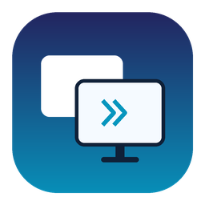
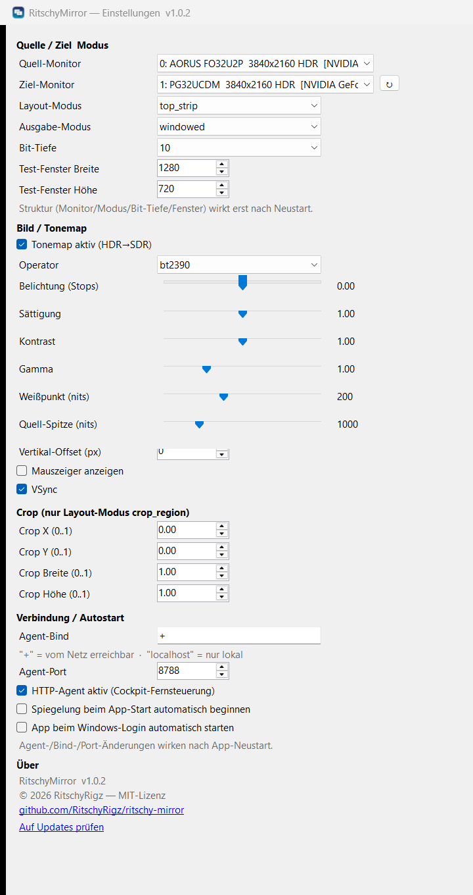

<p align="center">
  
</p>

<h1 align="center">RitschyMirror</h1>

<p align="center">
  <b>Mirror any monitor to your capture card — with proper HDR&nbsp;→&nbsp;SDR tonemapping.</b>
</p>

<p align="center">
  A lightweight Windows tool for <b>dual-PC / capture-card streaming setups</b>.<br>
  Pick a source monitor, fit it cleanly onto your capture display, lock the mouse out — done.
</p>

<p align="center">
  
  
  
  
</p>

---

## What is this for?

If you stream from a **two-PC setup** (a gaming PC feeding a capture card on a second
streaming PC), you usually need to send **one specific monitor** into the capture card.
The common trick is OBS's *Fullscreen Projector* — but it has real problems:

- 🌫️ **HDR looks washed-out / grey** when a capture card grabs it as SDR.
- 📐 **Ultrawide / mismatched resolutions** don't fit a 16:9 capture cleanly.
- 🖱️ The projector eats a whole display and **your mouse keeps wandering into it**.
- 🧩 You're locked into whatever OBS decides to do with the image.

**RitschyMirror** is a small, dedicated app that does exactly this one job — and does it
better. It grabs a monitor, **tonemaps HDR → SDR** on the GPU, **fits / letterboxes / crops**
it to your capture resolution, optionally **locks the mouse out of the target display**, and
sends the result to the display your capture card is plugged into.

> Originally built to replace the OBS projector in my own dual-stream rig. It runs quietly in
> the system tray and just works.

<p align="center">
  
</p>

---

## Features

- 🎯 **Pick source & target monitor** from dropdowns — real monitor names (e.g. *AORUS FO32U2P*),
  HDR-aware, multi-GPU aware (source and target may even hang off **different graphics cards**).
- 🪟 **Or mirror a single window / fullscreen app** instead of a whole monitor — pick one app
  (e.g. just your game). Only that window is shown, so **alt-tabbing never flashes your desktop**
  into the capture card. Built on Windows.Graphics.Capture (the modern OS API, *not* injection →
  no anti-cheat risk, robust even when capture and game live on different GPUs).
- 🌈 **HDR → SDR tonemapping** on the GPU (`bt2390`, `reinhard`, `hable`, `aces`) with **live**
  exposure / saturation / contrast / gamma / paper-white controls.
- 🖼️ **Layout modes** — how the source fills the output:
  - `fit` — whole source, aspect-preserved, nothing cut off (true 1:1 mirror)
  - `stretch` — fill the frame (ignore aspect)
  - `top_strip` — source on top, black bar below (e.g. fit 21:9 content into a 16:9 frame)
  - `crop_region` — mirror a freely defined rectangle of the source
- 🖥️ **Output modes**:
  - `windowed` — a normal test window
  - `borderless` — borderless fullscreen on the target display
  - `fullscreen_block` — borderless fullscreen **+ mouse-lock** (the cursor is kept out of the
    target display; works on any setup, including cross-GPU). The mouse-lock runs on its own
    thread, so the cursor stays smooth at full polling rate (v1.2.1).
  - `exclusive` — true DXGI exclusive fullscreen (best when source & target share one GPU; falls
    back automatically to `fullscreen_block` otherwise)
- 🪟 **Lives in the system tray** — start/stop mirroring without a console window; nothing to
  babysit. Optional **auto-start at login**.
- 🎚️ **Live config** — most settings (image, layout, crop) apply **instantly** while mirroring.
- 🛡️ **Keeps your PC awake while mirroring** — holds off display power-off and sleep so the
  capture-card display can't drop out mid-stream (like a video player). On by default,
  toggleable in Settings and the dock.
- 🔌 **OBS / browser control dock** — the app serves a small control page you can add to OBS as a
  **Custom Browser Dock** (or open in any browser): status light, start/stop, monitor pick, and
  **live image + crop sliders**. Control the mirror without alt-tabbing. See below.
- 🎛️ **HTTP API** — `start` / `stop` / `config` / `displays` over LAN, so Stream Deck (via a
  web-request plugin) and custom dashboards can drive it too.

---

## Download & Install

1. Go to the [**Releases**](https://github.com/RitschyRigz/ritschy-mirror/releases) page and
   download **`RitschyMirror-Setup-1.3.0.exe`**.
2. Run it. It installs **per-user — no admin / UAC prompt** (like the VS Code user installer),
   into `…\AppData\Local\Programs\RitschyMirror`.
3. Pick your options (desktop icon, auto-start), finish, and the app starts in your tray.

> **Windows SmartScreen note:** the installer isn't code-signed yet, so Windows may show
> *"Windows protected your PC"*. Click **More info → Run anyway**. (Code signing is on the
> roadmap.)

To remove it later: **Settings → Apps → Installed apps → RitschyMirror → Uninstall.** It
removes itself completely, including its config.

---

## Quick start

1. Click the tray icon → **Einstellungen / Settings**.
2. **Quell-Monitor** = the monitor you want to capture. **Ziel-Monitor** = the display your
   capture card is plugged into.
3. Pick a **Layout-Modus** (`fit` is the safe default) and **Ausgabe-Modus**
   (`fullscreen_block` if you want the mouse locked out of the capture display).
4. Hit **Start** in the tray menu (or in the settings window).
5. Tune the image live with the **Tonemap / sliders** if your source is HDR.

---

## Remote control — OBS browser dock

The mirror runs on the PC whose monitor you're capturing; the **control dock** lets you start/stop
and tweak it from anywhere — most usefully right inside OBS on your streaming PC.

1. In OBS: **Docks → Custom Browser Docks…**
2. Dock Name: `RitschyMirror`, URL:
   - same PC as OBS → `http://localhost:8788/`
   - mirror on another PC (two-PC setup) → `http://<mirror-pc-ip>:8788/`
3. **Apply** → the dock appears; drag it where you like.

> For the dock to be reachable from another PC, the mirror PC must allow the agent on the network
> (the installer/app uses port `8788`; allow it through the firewall). On a single PC, `localhost`
> works out of the box.

The dock gives you a status light, one-click Start/Stop, source/target monitor pickers, layout &
output mode, and **live image + crop sliders** — no extra software, it's served by the app itself.

---

## Configuration

Settings live in two JSON files next to the executable (you normally never touch these — the
GUI writes them):

- **`mirror_config.json`** — render parameters. Image & layout keys apply **live**; structural
  keys (`source_display`, `target_display`, `output_mode`, `output_bit_depth`, window size) take
  effect on the next **render restart**.
- **`app_settings.json`** — the HTTP agent (port / bind / enabled) and auto-start.

See [`docs/ARCHITECTURE.md`](docs/ARCHITECTURE.md) for the full key reference, the HTTP agent
API, and how the rendering pipeline works internally.

---

## Build from source

Requires the **.NET 9 SDK** (and, for the installer, **[Inno Setup 6](https://jrsoftware.org/isinfo.php)**).

```powershell
# 1) Build a self-contained single-file .exe (no .NET needed on the target PC):
powershell -ExecutionPolicy Bypass -File publish.ps1

# 2a) Build the polished installer (RitschyMirror-Setup-x.y.z.exe):
powershell -ExecutionPolicy Bypass -File installer\build_installer.ps1

# 2b) …or just drop the app into place without an installer:
powershell -ExecutionPolicy Bypass -File install.ps1
```

---

## Tech

C# / .NET 9 + [Vortice.Windows](https://github.com/amerkoleci/Vortice.Windows) (Direct3D 11 /
DXGI). It uses **DXGI Desktop Duplication** (FP16, HDR-capable) → an **HLSL tonemap shader** →
a flip-model swap chain. Full internals in [`docs/ARCHITECTURE.md`](docs/ARCHITECTURE.md).

## License

[MIT](LICENSE) © RitschyRigz
